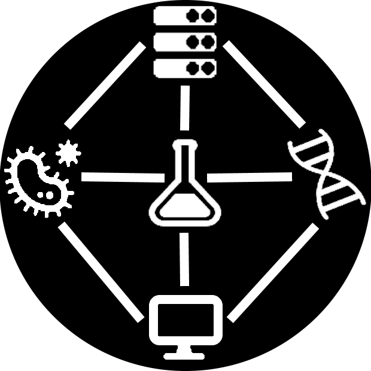

<table>
  <tr>
    <td style="text-align:left">
      
    </td>
    <td>
    <H1>Lecture on Biomedical semantics, information retrieval and knowledge discovery</H1>
    </td>
  </tr>
</table>

## Motivation
* This lecture on "Biomedical semantics, information retrieval and knowledge discovery" aims at introducing studies with no previous knowledge on the topics to the world of the Semantic Web and Linked Data with a special focus on Biomedical knowledge and resources.
* You will learn how to use data in a way that it is human and machine readable 
and processable.
* Semantics is used to add labels and meaning to data and to offer opportunities 
to gather and analyse data around labels, meaning and human understandable topics.
* The introduction of semantics requires special formats and standards to make 
the data useful for the general public to provide interoperability.

## Who can use this material?
By now, only students enrolled in a course using these training materials will have access to the full content. 

License: This material is distributed under [CC BY-NC](https://creativecommons.org/licenses/by-nc/4.0/){:target="_blank"}

If you reuse these materials or want to reference them, please use the following citation (also provided via a [CITATION](./CITATION.cff){:target="_blank"} file):

Castro LJ., Rebholz-Schuhmann D (2022). Lecture on Biomedical semantics, information retrieval and knowledge discovery. 

## Acknowledgements

## Useful links
* [Citation file](./CITATION.cff){:target="_blank"}
* [License file](./LICENSE){:target="_blank"}

